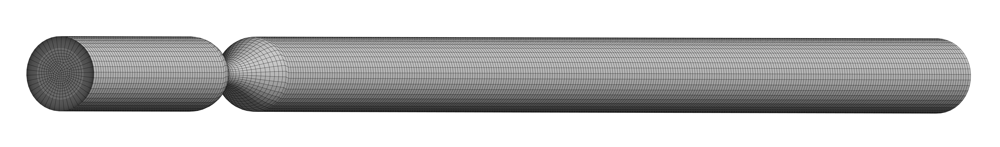

# CFD Simulation of Blood Flow Through a Severely Stenosed Artery

## Project Overview

This project presents selected computational fluid dynamics (CFD) visualizations of pulsatile blood flow through a severely stenosed artery (90%). The simulation was performed using **ANSYS Fluent*[...]

## Motivation

**Arterial stenosis** is the narrowing of an artery that restricts blood flow and alters the normal hemodynamic behavior of blood. In this study, an **axisymmetric artery** is considered to investi[...]

## Purpose

* To understand the characteristics of blood flow in a **healthy, non-stenotic axisymmetric artery**.
* To investigate how blood-flow behavior changes with **different degrees of arterial area reduction (stenosis severity)**.
* To examine the hemodynamic consequences of severe stenosis and understand the role of **bypass procedures in restoring or improving blood flow**.

## Computational Approach

* **CFD solver:** ANSYS Fluent
* **Numerical method:** Finite Volume Method (FVM)
* **Flow:** Pulsatile Blood flow through an arterial stenosis
* **Blood model:** Carreau (Non-Newtonian)
* **Governing Equation:** RANS (Reynolds-Averaged Navier–Stokes)
* **Case presented:** 90% stenosis
* **Post-processing:** Velocity, pressure, velocity vectors, streamlines, wall shear stress, and artery geometry

## Geometry and Mesh

### Artery Geometry

The 3D model of the stenosed artery illustrating the 90% narrowing in the vessel lumen and the complete computational domain. The geometry captures the arterial structure with the stenotic constri[...]

### Artery Mesh

The computational mesh generated for the finite volume discretization of the stenosed artery domain employs a structured hexahedral approach optimized for accurate hemodynamic analysis.

**Meshing Specifications:**

* **Element Type:** Hexahedral elements
* **Meshing Method:** Sweep method along the axial direction of the vessel
* **Inflation Layers:** Maximum 15 layers with growth rate = 1.1 to resolve boundary layer effects and wall shear stress variations

**Mesh Sizing:**
* **Global element size:** 0.15 mm
* **Local refinement:** Sphere of influence radius = 2.5 mm with local element size = 0.05 mm at the stenosis region to accurately capture high velocity gradients and flow separation
* **Coarser mesh spacing** in the straight upstream and downstream sections to reduce computational cost where flow gradients are more uniform

**Mesh Quality Metrics:**
* **Skewness:** < 0.58 (high-quality elements)
* **Orthogonal Quality:** > 0.588 (ensures convergence and stability in simulations)

These quality metrics ensure robust numerical solutions and minimize numerical errors in the CFD analysis.

## Selected Simulation Visualizations

### Velocity Contour

The velocity contour illustrates the spatial distribution of flow velocity within the stenosed artery, showing acceleration through the narrowed region.

### Velocity Vector Field

The velocity vectors provide a visualization of the local flow direction and magnitude throughout the arterial domain.

### Pressure Contour

The pressure contour presents the computed pressure field throughout the arterial domain, demonstrating the pressure drop across the stenotic region.

### Wall Shear Stress (WSS) Contour

The wall shear stress distribution illustrates the variation of shear loading along the arterial wall, highlighting regions of elevated stress concentration at and downstream of the stenosis.

### Streamlines

The streamlines illustrate the overall flow pattern through the stenotic region and downstream of the constriction, revealing flow separation and recirculation zones.

## Key Hemodynamic Findings

* **Flow Acceleration:** Significant velocity increase through the stenosed section
* **Pressure Drop:** Substantial pressure reduction across the 90% stenosis
* **Wall Shear Stress:** Elevated WSS in the stenosis region with potential for endothelial dysfunction
* **Recirculation Zones:** Formation of vortices and flow separation downstream of the stenosis
* **Complex Flow Patterns:** Non-Newtonian blood behavior influences local hemodynamic conditions

## Clinical Significance

These CFD visualizations demonstrate the complex hemodynamic environment created by severe arterial stenosis, which is relevant to:
- Clinical diagnosis and risk assessment
- Interventional treatment planning
- Stent and scaffold design optimization
- Thrombotic risk evaluation
- Endothelial dysfunction research

## Grid Independence Test

A grid independence (mesh convergence) test was performed to verify that the computed velocity field is insensitive to further mesh refinement. The attached image `images/Grid_independence_Test_75%_Stenosis.png` shows the comparison of velocity results between the coarse and fine meshes for a 75% stenosed artery. The same mesh design and refinement strategy were applied to the 90% stenosis case presented in this repository.

Summary (please replace placeholders with the measured values from your convergence study):

- Reference case: 75% stenosis (same mesh strategy applied to 90% case).
- Sampling location and phase: centerline velocity at peak systole (replace if different).
- Mesh element counts: coarse = <N_coarse> elements, fine = <N_fine> elements.
- Maximum relative difference in peak velocity between coarse and fine meshes: <X %>.
- Mean L2-norm difference across sampled points: <Y> (units: m/s).

Because the measured differences are negligible (maximum relative difference < <X %>), the selected mesh configuration is considered grid-independent for the presented simulations.

Figure: Grid independence test — comparison of velocity profiles (coarse vs. fine mesh) for 75% stenosis. Velocity sampled along the centerline at peak systole. Blue: coarse mesh; Red: fine mesh. Units: m/s.

## Note

This repository presents selected visualizations from an ongoing research project. Detailed quantitative results, comparative analyses, and other research findings are reserved for the associated publ[...]
