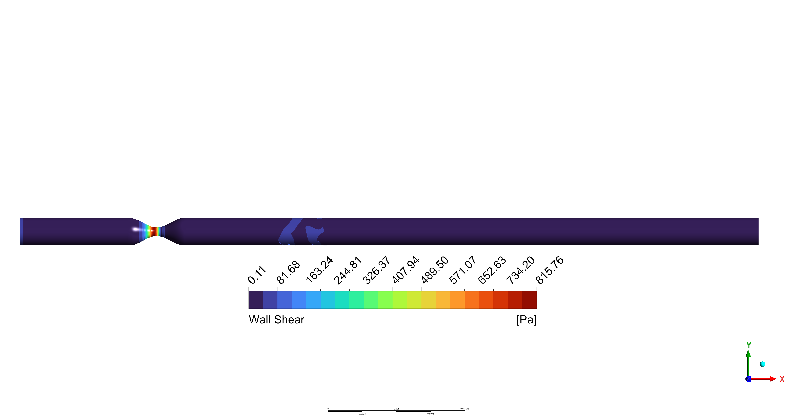

# Blood Flow Simulation Using ANSYS Fluent

A CFD simulation of blood flow through a stenosed artery performed using ANSYS Fluent.

## Simulation Result

### Wall Shear Stress

### Flow Animation
<video width="100%" controls>
  <source src="animation.wmv" type="video/x-ms-wmv">
  Your browser does not support the video tag.
</video>
