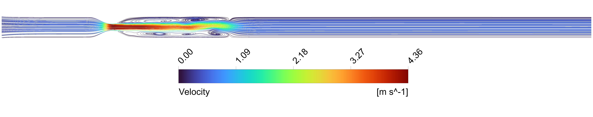
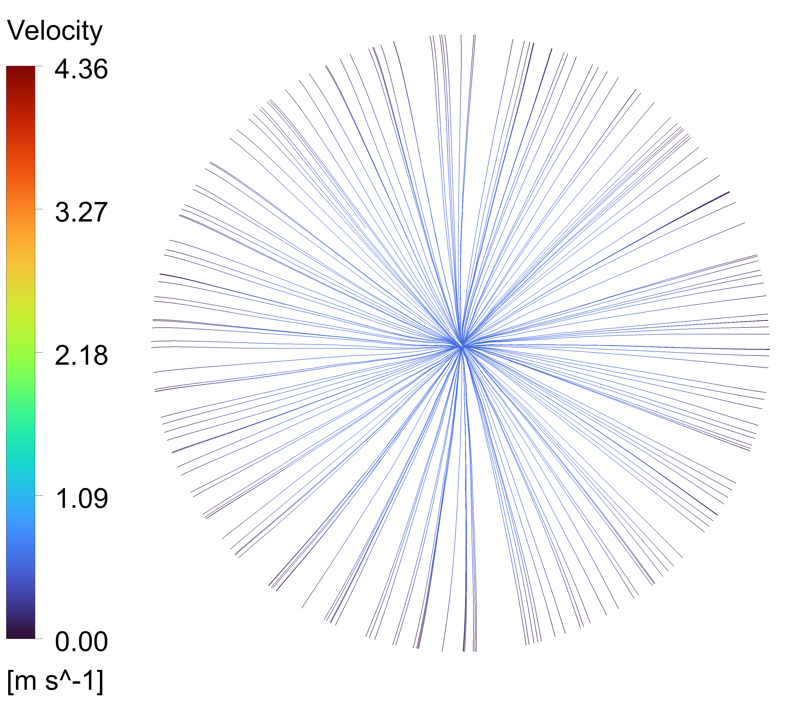
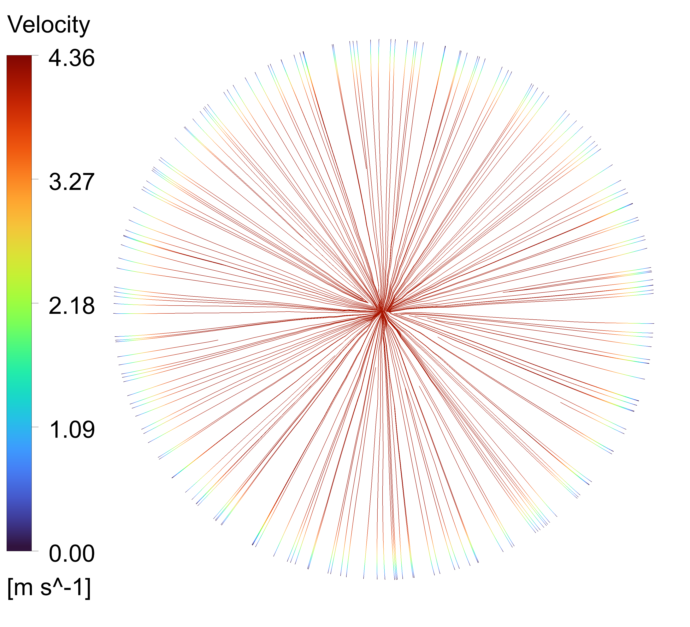
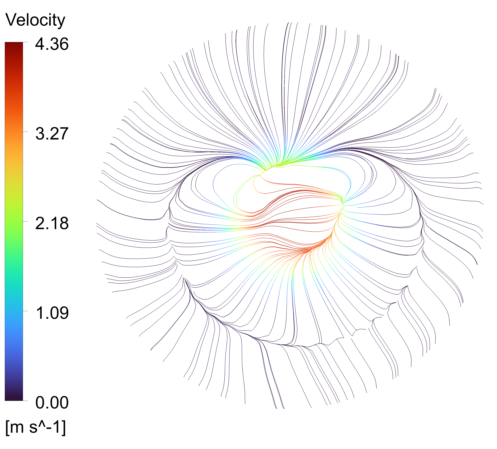
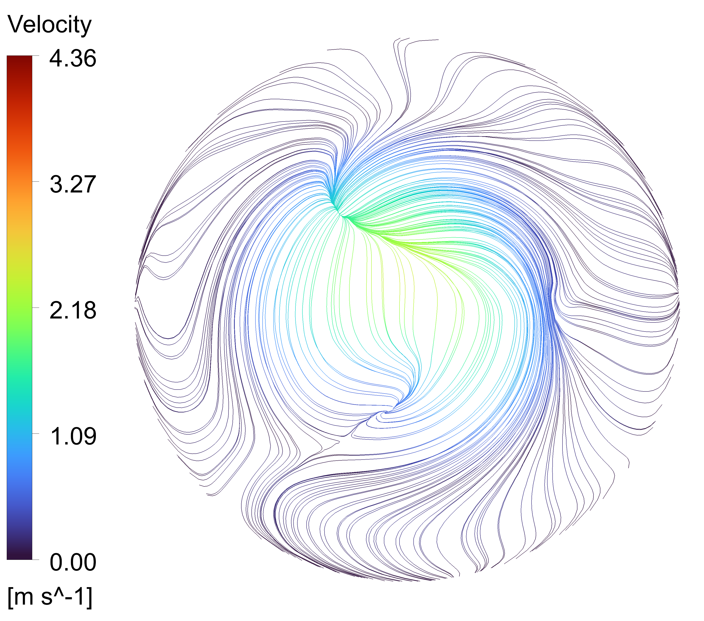
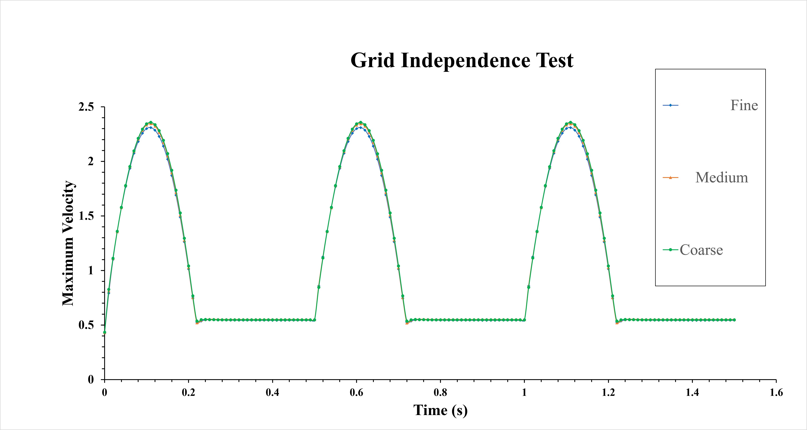

# CFD Simulation of Blood Flow Through a Severely Stenosed Artery

## Overview

This repository contains computational fluid dynamics (CFD) visualizations and supporting notes from a study of pulsatile blood flow through an axisymmetric artery with severe stenosis. The primary case presented here is a 90% area reduction (stenosis throat). Simulations were performed in ANSYS Fluent using a non-Newtonian blood model to capture physiologically relevant hemodynamic behavior.

## Table of Contents

- [Overview](#overview)
- [Motivation & Purpose](#motivation--purpose)
- [Computational Approach](#computational-approach)
- [Geometry and Mesh](#geometry-and-mesh)
- [Selected Visualizations](#selected-visualizations)
- [Stenosis Flow — Streamline Analysis](#stenosis-flow--streamline-analysis)
- [Key Hemodynamic Findings](#key-hemodynamic-findings)
- [Grid Independence Test](#grid-independence-test)
- [Clinical Significance](#clinical-significance)
- [Research Note & Data Availability](#research-note--data-availability)

## Motivation & Purpose

Arterial stenosis (narrowing of the vessel lumen) substantially alters local hemodynamics and is associated with clinical problems such as ischemia, thrombosis, and endothelial dysfunction. This repository aims to:

- Document and visualize blood-flow characteristics in an axisymmetric artery with varying stenosis severity.
- Highlight how flow behavior changes with increasing area reduction.
- Provide illustrative results relevant to intervention planning (e.g., bypass or stent strategies) and device design.

---

## Computational Approach

- CFD solver: ANSYS Fluent
- Numerical method: Finite Volume Method (FVM)
- Flow: Pulsatile blood flow through arterial stenosis
- Blood rheology: Carreau (non-Newtonian) model
- Governing equations: RANS (Reynolds-Averaged Navier–Stokes)
- Case presented in this README: 90% stenosis
- Post-processing: velocity, pressure, velocity vectors, streamlines, wall shear stress (WSS), and geometry visualizations

---

## Geometry and Mesh

### Artery Geometry

The 3D model represents an axisymmetric artery with a localized stenotic constriction (90% area reduction at the stenosis neck).

### Mesh and Meshing Strategy

A structured hexahedral mesh (sweep) was used with inflation layers near the wall to resolve boundary-layer gradients.

Key meshing specifications:
- Element type: hexahedral
- Meshing method: sweep along the axial direction
- Inflation: up to 15 layers, growth rate = 1.1
- Global element size: 0.15 mm
- Local refinement: sphere of influence centered on the stenosis (radius 2.5 mm) with element size ≈ 0.05 mm

Mesh quality metrics (typical):
- Skewness: < 0.58
- Orthogonal quality: > 0.588

These choices balance accuracy near the stenosis (high velocity gradients and separation) with computational cost in the straight sections.

---

## Selected Visualizations

Representative post-processed images showing the most important hemodynamic fields are included in the `images/` folder.

- Velocity contour

- Velocity vector field

- Pressure contour

- Wall shear stress (WSS)

- Streamlines

---

## Stenosis Flow — Streamline Analysis

This section summarizes streamline patterns extracted at key axial cross-sections referenced to the stenosis neck at z = 0.

Model reference parameters:

- Vessel diameter (D): 20 mm
- Origin (0D): stenosis neck (z = 0 mm)
- Upstream reference (-1D): z = -20 mm
- Downstream reference (1D): z = +20 mm
- Far downstream reference (5D): z = +100 mm

Below are the streamline visualizations compared at four distinct axial positions along the flow path:

<table>
  <tr>
    <td align="center" width="25%">
       
      <b>-1D (-20 mm)</b> 
      <i>Upstream Flow</i>
    </td>
    <td align="center" width="25%">
       
      <b>0D (0 mm)</b> 
      <i>Stenosis Neck</i>
    </td>
    <td align="center" width="25%">
       
      <b>1D (+20 mm)</b> 
      <i>Downstream Recirculation</i>
    </td>
    <td align="center" width="25%">
       
      <b>5D (+100 mm)</b> 
      <i>Far Downstream Recovery</i>
    </td>
  </tr>
</table>

Observations:
- At -1D the flow is attached and slowly accelerating toward the constriction.
- At 0D streamlines converge and accelerate sharply through the neck, indicating a strong local increase in axial velocity.
- At +1D separated flow and recirculation regions form immediately downstream of the stenosis, which can promote low-WSS regions and increased residence time.
- By +5D the bulk flow gradually recovers but smaller-scale disturbances can persist depending on pulsatility and Reynolds number.

---

## Key Hemodynamic Findings

- Flow acceleration is pronounced at the stenosis throat with large velocity gradients.
- A significant pressure drop occurs across the 90% stenosis.
- Wall shear stress is elevated at the stenosis throat and exhibits gradients downstream that correlate with flow separation.
- Recirculation and vortex structures form immediately downstream of the stenosis and can persist depending on flow pulsatility and geometry.
- Non-Newtonian rheology (Carreau model) affects near-wall shear and local flow structures.

---

## Grid Independence Test

A grid independence study was conducted on a 75% stenosis case using three mesh sizes (element sizes: 0.20 mm, 0.15 mm, and a locally refined 0.05 mm). Differences in peak velocities were less than 2%, confirming the mesh convergence. The same meshing approach was applied to the 90% stenosis case.

---

## Clinical Significance

The visualizations and analyses included here are useful for:

- Clinical diagnosis and risk assessment
- Pre-interventional planning (bypass, stent sizing/placement)
- Device design and optimization
- Thrombotic risk and endothelial response studies

---

## Research Note & Data Availability

This repository contains a selected set of simulation visual outputs from ongoing research. Complete quantitative datasets, full simulation files, and additional results are currently reserved for upcoming publication and will be released following peer review.

